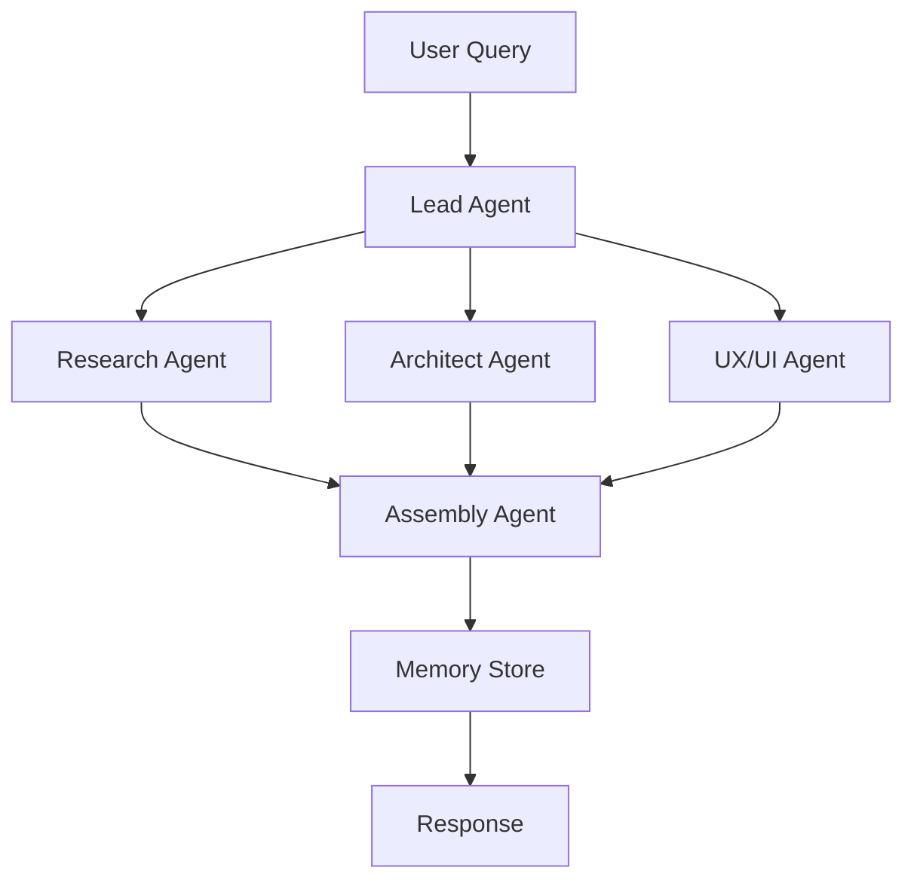

# Multi-Agent System Brainstorm

## 🚀 MVP Multi-Agent System with n8n

### 📋 Project Overview

A sophisticated multi-agent system implementing the Anthropic architecture pattern using n8n workflow automation, JSON schemas for communication, and stateless agents with context passing.

### 🏗️ Architecture

**Type:** STATELESS with Context Passing + Centralized Memory  
**Date:** 06/09/2025  
**Version:** 1.0.0  
**Status:** 🟢 In Development

### 📁 Project Structure

```
├── /docs
│   ├── /schemas        # JSON schemas for agent communication
│   ├── /architecture   # System architecture documentation
│   └── /api           # API documentation
├── /prompts           # Agent prompts library
├── /n8n              # n8n workflow files
├── /tests            # Test cases and validation
└── /examples         # Usage examples
```

### 🤖 Agents

1. **Lead Agent (Orchestrator)** - Task decomposition and delegation
2. **Research Agent** - Information gathering and web search
3. **Architect Agent** - System design and technical decisions
4. **UX/UI Agent** - Interface design and user experience
5. **Test Agent** - Quality assurance and validation
6. **Assembly Agent** - Result aggregation and reporting

### 🔄 Data Flow



### 🛠️ Technology Stack

- **Workflow Engine:** n8n v1.0+
- **LLM:** Claude (Anthropic)
- **Memory:** Redis/In-memory
- **Communication:** JSON schemas
- **Validation:** JSON Schema v7

### 📚 Documentation

- [Architecture Overview](/docs/architecture/overview.md)
- [JSON Schemas](/docs/schemas/)
- [Agent Prompts](/prompts/)
- [API Reference](/docs/api/)
- [Setup Guide](/docs/setup.md)

### 🚦 Quick Start

1. Clone the repository
2. Import n8n workflows from `/n8n` folder
3. Configure LLM credentials
4. Test with example requests

### 📊 Project Status

- [x] Architecture Design
- [x] JSON Schema Definition
- [ ] Agent Implementation
- [ ] n8n Workflow Setup
- [ ] Testing & Validation
- [ ] Production Deployment

### 🤝 Contributing

Contributions are welcome! Please read our contributing guidelines.

### 📄 License

MIT License

### 📞 Contact

Uptax Team - [GitHub](https://github.com/Uptax-creator)

---

*Built with ❤️ by Uptax Team*